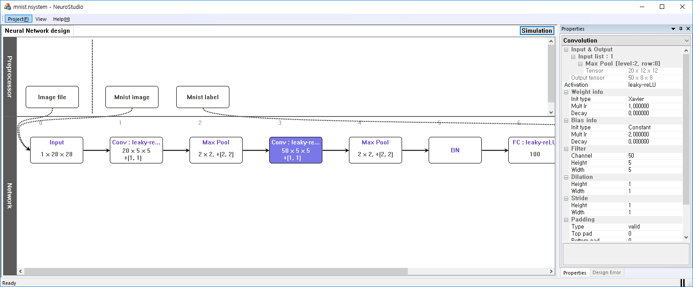
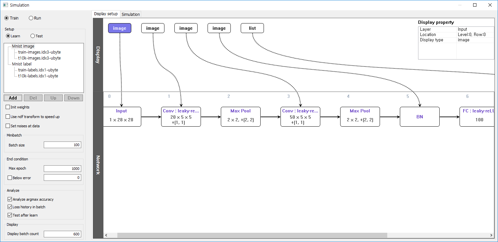
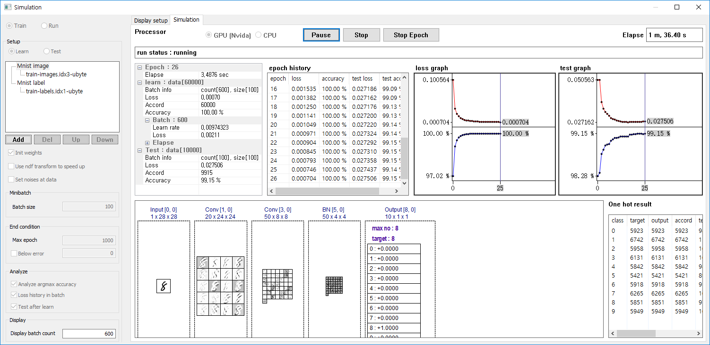

# Neuro Studio

Neuro Studio is GUI based Deep-learning Framework. It has been developed by Jae Wook Kim since 2015.
Neuro Studio, a deep-learning development tool that requires no coding process, enabling development of deep-learning models even with a mere mouse and quickly improve the models with visualization tools.
- Milestones
1)	GUI based Deep-learning development environment and a test tool
Preprocessors and layers are placed in the grid window, and the connection between them is expressed using Bezier line, so that the entire structure and the data flow can be understood at a glance. One can easily modify layer properties and hyper parameters through an integrated setup windows.
2)	Developed Deep-learning Operational Engine
The engines are based on the analysis of open sources such as Caffe, Caffe 2, tiny-dnn and customized for Neuro Studio. Designed to maximize performance by reducing memory allocation and copying between CPU and GPU.
3)	Developed Deep-learning Store System, NSAS (Neuro Storage Access Spec)
Enabled dynamic access and efficient partial storage for storing huge models on storage media.

Some screenshots are below
- Create model

- Setup displays for simulation

- Visualization Tool for simulation

[Sample Video](https://www.youtube.com/watch?v=WvbD-ejz2NI)

## Future plans
- Fix some bugs including gui related bugs
- Test with LSTM
- Add some data preprocessor
- Add an environment for Reinforcement Learning, including the latest algorithms such as A3C as well as DQN
- Add an environment for GAN, including the latest algorithms such as Progressive growing of GANs
- Add more layer and loss, optimizer algorithms
- Develope a Virtual Machine to run a model by created Neuro Studio. It will run any computer machine.

## Environments
This source must be compiled whth CUDA support.
So, you need to install CUDA 9.0, cudnn v7.x libraries.

All code except file handling and gui parts of Neuro Studio is developed in Standard C++.
It currently works in Windows 7 and above, but if you modify only a few parts, such as gui, you will be able to work on linux as well.

## License
Neuro Studio is BSD-style licensed, as found in the LICENSE file.
